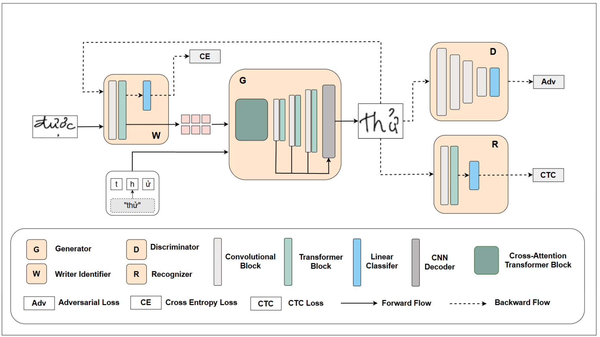

# WriteViT

<p align="center"><em>Handwritten Text Generation with Vision Transformers</em></p>

<p align="center">
  <a href="https://arxiv.org/abs/2505.13235"></a>
  <a href="https://colab.research.google.com/drive/15Lswqr-aQwI-fF6yRoGYt-2pxSlC2L-R"></a>
  <a href="LICENSE"></a>
</p>

WriteViT is a one-shot handwritten text synthesis framework for learning a writer's style from a small set of reference images. It combines a ViT-based writer encoder, a multi-scale Transformer generator with conditional positional encoding, and a lightweight ViT recognizer. The project supports both English and Vietnamese handwriting generation.

<p align="center">
  
</p>

## Resources

- [Paper](https://arxiv.org/abs/2505.13235)
- [Interactive demo](https://colab.research.google.com/drive/15Lswqr-aQwI-fF6yRoGYt-2pxSlC2L-R)
- [Datasets and checkpoints](https://drive.google.com/drive/folders/1ZgYS6-6l6fjKY75RJipONBByujIgf-uE?usp=sharing)

## Installation

Python 3.7 or newer and a CUDA-capable GPU are recommended for training.

```bash
git clone https://github.com/hnam-1765/WriteViT.git
cd WriteViT

python -m venv .venv
source .venv/bin/activate
python -m pip install --upgrade pip
python -m pip install -r requirements.txt
```

Install the PyTorch build appropriate for your CUDA version if the default package does not match your system. See the [PyTorch installation guide](https://pytorch.org/get-started/locally/).

## Data and checkpoints

Download the prepared datasets and checkpoints from the link above, then place the dataset pickle files in `File/`. The default IAM configuration expects:

```text
File/
├── IAM.pickle
├── english_words.txt
├── vn_words.txt
└── unifont.pickle
```

The prepared dataset is a dictionary split by writer:

```python
{
    "train": {
        "writer_id": [
            {"img": PIL.Image.Image, "label": "handwritten text"},
            # ...
        ]
    },
    "test": {
        "writer_id": [
            {"img": PIL.Image.Image, "label": "handwritten text"},
            # ...
        ]
    },
}
```

To use another dataset or language, update `DATASET`, `DATASET_PATHS`, `NUM_WRITERS`, `WORDS_PATH`, and `ALPHABET` in `params.py`. More information about the auxiliary files is available in [`File/README.md`](File/README.md).

## Training

Review the experiment settings in `params.py`, especially the dataset paths, batch size, backbone, learning rates, and resume flag. Then start training with:

```bash
CUDA_VISIBLE_DEVICES=0 python train.py
```

The device is selected automatically by PyTorch. Checkpoints are written to `saved_models/<EXP_NAME>/`. The training setup also prepares `saved_images/<EXP_NAME>/` for generated samples and evaluation artifacts.

The available recognizer backbones are `resnet18`, `vgg11`, and `vgg19`.

## Results

### Handwriting generation

<p align="center">
  
</p>

### Handwriting reconstruction

<p align="center">
  
</p>

## Repository structure

```text
WriteViT/
├── data/           # Dataset loading and preparation utilities
├── Figures/        # Architecture and qualitative results
├── File/           # Lexicons, Unifont data, and prepared datasets
├── models/         # Generator, discriminators, recognizer, and writer encoder
├── util/           # Shared model and training utilities
├── params.py       # Experiment and dataset configuration
└── train.py        # Training entry point
```

## Citation

If you use WriteViT in your research, please cite:

```bibtex
@article{nam2025writevit,
  title   = {WriteViT: Handwritten Text Generation with Vision Transformer},
  author  = {Dang Hoai Nam and Huynh Tong Dang Khoa and Vo Nguyen Le Duy},
  journal = {arXiv preprint arXiv:2505.13235},
  year    = {2025}
}
```

## Acknowledgements

This repository builds on [Handwriting Transformers](https://github.com/ankanbhunia/Handwriting-Transformers) by Ankan Kumar Bhunia et al. We thank the authors for making their work publicly available.

## License

This project is released under the [MIT License](LICENSE).
